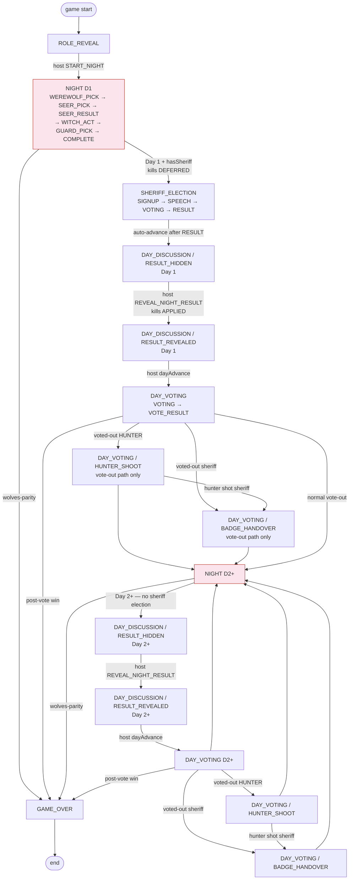
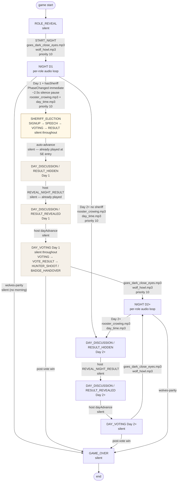

# Game phase flow — canonical reference

> **Status: VERIFIED**. Source of truth for the Variant B game-phase /
> audio-cue contract. Sign-off: 2026-05-03. Update this file in the same
> PR as any change to `GamePhasePipeline.kt`, `NightOrchestrator.kt`,
> `VotingPipeline.kt`, `SheriffService.kt`, or `AudioService.kt` — the
> chart and the code must move together.

Scope: 12-player CLASSIC game with `hasSheriff = true`. Charts trace a
full game across **Night 1 → Day 1 (with sheriff election) → Night 2 → Day 2 → …** until either side wins. Every edge cites a `file:line` so each can be audited.

## Game-rule highlights baked into these charts

1. **Variant B sheriff order**: the sheriff is elected on Day 1 *morning*,
   between Night 1 and the host's death-reveal, with the N1 victims still
   alive in DB so they can sign up / speak / vote / 上警.
2. **Deferred kills**: Night 1 kills are *computed* at end of N1 but only
   *applied* when the host clicks REVEAL_NIGHT_RESULT.
3. **Night-killed players have no last action**: sheriff killed at night
   → badge silently disappears (no BADGE_HANDOVER); hunter killed at
   night → just dies (no HUNTER_SHOOT). Last actions only on **vote-out**.
4. **Sheriff election is once-per-game**, only on Day 1. Subsequent days
   skip it and go straight to DAY_DISCUSSION/RESULT_HIDDEN.

---

## Chart A — Game phase flow (no audio)



> Code references for each edge are listed in the table below — pulled into the
> chart proper would clutter the labels and break Mermaid Live's narrow lanes.

### Key edges to verify

| Edge | Code | Rule |
|---|---|---|
| `NIGHT(D1) → SHERIFF_ELECTION` | `NightOrchestrator.kt:322-377` | Day 1 only, hasSheriff, no sheriff yet |
| `SHERIFF_ELECTION → DAY_DISCUSSION/RESULT_HIDDEN` | `SheriffService.kt:533-543` | Auto-advance after election RESULT |
| `DAY_DISCUSSION/RESULT_HIDDEN → /RESULT_REVEALED` | `GamePhasePipeline.kt:39-85` | Host clicks reveal; kills applied here |
| `NIGHT → DAY_DISCUSSION/RESULT_HIDDEN` (Day 2+) | `NightOrchestrator.kt:355-408` | Day 2+, no sheriff election |
| `NIGHT → GAME_OVER` | `NightOrchestrator.kt:286-321` | Wolves-parity short-circuit on projected alive |
| **`NIGHT-kill sheriff` does NOT go through BADGE_HANDOVER** | `GamePhasePipeline.kt:69` | Post-revert: always `RESULT_REVEALED` regardless of who died |
| **`NIGHT-kill hunter` does NOT go through HUNTER_SHOOT** | `GamePhasePipeline.kt:69` | Same |
| `Vote-out sheriff` → `DAY_VOTING/BADGE_HANDOVER` | `VotingPipeline.kt:handleBadge` | Vote-out path only |
| `Vote-out hunter` → `DAY_VOTING/HUNTER_SHOOT` | `VotingPipeline.kt:handleHunterShoot` | Vote-out path only |

---

## Chart B — Game phase + audio flow

Audio is server-emitted via STOMP `DomainEvent.AudioSequence`. Frontend
queues + dedupes; high-priority (`>=10`) appends rather than clears
when role-narrative audio is still draining (PR #69).



### Per-role night audio (sub-phase transitions, same on every night)

```mermaid
flowchart LR
    NSTART(["NIGHT entry"]) -->|"goes_dark_close_eyes<br/>wolf_howl"| WP["WEREWOLF_PICK<br/>wolf_open_eyes"]
    WP -->|"wolf_close + seer_open"| SP["SEER_PICK"]
    SP -->|"seer_close"| SR["SEER_RESULT"]
    SR -->|"witch_open"| WA["WITCH_ACT"]
    WA -->|"witch_close + guard_open"| GP["GUARD_PICK"]
    GP -->|"guard_close"| NC["COMPLETE"]
    NC --> NEND(["resolveNightKills"])
```



Source: `AudioService.calculateNightSubPhaseTransition` at
`AudioService.kt:95-132` + `RoleRegistry.getOpenEyesAudio` /
`getCloseEyesAudio`. Sub-phase audio fires at priority 5; main phase
transitions fire at priority 10.

### Day 1 vs Day 2+ morning audio (the bug fix)

| Day | Transition | Audio | Why |
|---|---|---|---|
| **Day 1** | NIGHT → **SHERIFF_ELECTION** | (PhaseChanged immediate) → ~2.5s silence pause → 🔊 `rooster_crowing` + `day_time` | Players need an "open eyes" cue right after GUARD's close-eyes; the brief silence separates "night ended" from "campaign begins" before the morning cue plays |
| **Day 1** | SHERIFF_ELECTION → DAY_DISCUSSION/RESULT_HIDDEN | (silent) | Already played at SHERIFF_ELECTION entry |
| **Day 1** | RESULT_HIDDEN → RESULT_REVEALED (host reveal) | (silent) | Already played |
| **Day 2+** | NIGHT → DAY_DISCUSSION/RESULT_HIDDEN | 🔊 `rooster_crowing` + `day_time` | No sheriff election in the way; morning cue rides the NIGHT→DAY transition (unchanged from pre-Variant-B) |
| **Day 2+** | RESULT_HIDDEN → RESULT_REVEALED | (silent) | Already played |
| **Any** | DAY_VOTING → NIGHT | 🔊 `goes_dark_close_eyes` + `wolf_howl` | Night-entry cue, unchanged |

The discriminator is the `oldPhase` argument to `AudioService.calculatePhaseTransition`:

```
NIGHT → SHERIFF_ELECTION         → emit rooster + day_time   (priority 10)
SHERIFF_ELECTION → DAY_DISCUSSION → emit nothing             (suppressed)
NIGHT → DAY_DISCUSSION           → emit rooster + day_time   (existing path)
* → DAY_DISCUSSION (other)       → emit rooster + day_time   (default)
```

See `AudioService.kt:58-83` for the implementation.

The **silence pause** between guard_close_eyes and the morning cue is implemented
server-side: `NightOrchestrator.resolveNightKills` (the SHERIFF_ELECTION branch)
broadcasts `PhaseChanged` immediately at end-of-night, then a coroutine
`delay(sheriffMorningCueDelayMs)` (default `2500ms`) before broadcasting the
`AudioSequence`. By the time the rooster cue arrives at the frontend, the audio
queue has drained — guard_close_eyes has finished playing and the player
perceives a brief silence before the morning audio. Tunable via
`werewolf.timing.sheriff-morning-cue-delay-ms` for tests/dev/prod.

---

## Verified design decisions (2026-05-03)

These pinned-down points back the contract. Don't relitigate without
opening a PR that updates this file.

1. **Day-1 morning audio plays after a small silence pause**, not back-to-back with `guard_close_eyes`. The pause separates "night ended" from "campaign begins" semantically. Implemented as a server-side `delay(sheriffMorningCueDelayMs)` between the `PhaseChanged` and `AudioSequence` broadcasts (see `NightOrchestrator.resolveNightKills` SHERIFF_ELECTION branch).
2. **A wolves-parity-N1 GAME_OVER plays no morning audio.** Game ends in the dark; the night-init / role-loop audio remains the only night audio that played.
3. **`SHERIFF_ELECTION → DAY_DISCUSSION` is silent.** No "campaign closed" jingle. The morning cue already played at SHERIFF_ELECTION entry, and DAY_DISCUSSION on Day 1 is just the host walking players through the result-reveal click.
4. **`DAY_VOTING/*` is the only place BADGE_HANDOVER and HUNTER_SHOOT fire.** Night kills go straight to `DAY_DISCUSSION/RESULT_REVEALED`; the badge silently disappears, the hunter just dies. Last actions only on **vote-out**, when the player still has agency at the moment of elimination.
5. **Sheriff election is one-shot per game (Day 1 only).** If the sheriff is voted out / killed and the badge is destroyed, no re-election happens.
