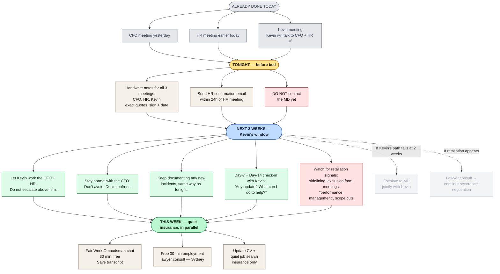

# Decision Map — Strategic Next Move

## My read

The CFO has escalated. His comments yesterday (salary, "prove your value", contract review, no-laptop rule) are textbook **adverse action territory** under Fair Work Act s.340 — he is altering your position to your prejudice *because* you exercised a workplace right. That is a **stronger** legal position for you than the original incident. Don't waste it by escalating emotionally.

## My read on the leverage

> CFO costs the company **~$250k–$600k** to replace. → **Internal leverage > litigation. Always.**

---

## What to do — flowchart

**Where you are right now:** Kevin has agreed to talk to the CFO and HR. That puts you on the **best of the three branches** — internal sponsor working the problem at his level. Your job for the next 2 weeks is **stay quiet, stay professional, keep documenting, and let Kevin operate**. The 2-week clock starts from his commitment. The greyed branches at the bottom are *future paths only if his approach doesn't land* — don't activate them yet.

---

## TONIGHT in detail — the two anchor actions

These two tasks are the ones that quietly build your file. They cost an hour total and determine the strength of every later step. **Do both before you go to sleep tonight** — memory of three same-day meetings will not survive overnight intact.

### 1. Handwritten contemporaneous notes

**Why:** Courts and the Fair Work Commission give significant weight to **contemporaneous notes** — notes written at the time, or as soon as practical afterwards. They are admissible evidence and treated as more reliable than later recollection. Typed notes on a work device are weak (employer-controlled, no clear timestamp). Handwritten notes on paper are strong, and they work around the CFO's no-laptop rule.

**How (do this tonight, before memory fades):**

1. Take a notebook (or any blank paper).
2. For each of the three meetings (yesterday's CFO meeting, today's HR meeting, today's Kevin meeting), write on a fresh page:
   - **Date and time** the meeting started and ended
   - **Location** (room, Teams, phone)
   - **Attendees** by name and role
   - **Exact quotes in quotation marks** for anything significant — e.g. *"you're paid high"*, *"prove your value"*, *"I've reviewed your contracts"*, *"the contract says you have to do overtime"*, *"no laptops in finance meetings"*
   - Your own questions and the responses (or non-responses)
   - Anything physical: who walked out, who raised their voice, who interrupted
3. **Sign and date each page** at the bottom — *"[Your name], [date], [time written]"*.
4. **Photograph each page** with your phone. Upload to **personal cloud** (iCloud / personal Gmail Drive), not OneDrive or anything company-issued.
5. Keep the originals at home, not at the office.

**Rule:** Facts only — what was said, what was done. **No adjectives, no speculation about motive.** *"He stated that…"* not *"He aggressively…"*. The professionalism of the notes is part of what makes them credible later.

### 2. HR follow-up email — same day

**Why:** HR already has their own record of today's meeting — their notes, written in their words, framed their way. Without a written contribution from you, **theirs is the only version on file**, and over time it can be softened, reinterpreted, or used to downplay the facts you raised. A short same-day confirmation email puts **your version** on record in **your words**, locks in HR's stated position (silence means tacit agreement; any correction means you also get their written version), and makes the record contemporaneous — which is what gives it weight later.

**Template — adapt and send today:**

> **To:** [HR partner]
> **Subject:** Confirming our discussion today
>
> Hi [HR partner first name],
>
> Thank you for meeting with me today. To make sure I've understood correctly, I'd like to confirm in writing what we discussed:
>
> 1. I raised the events of 24 April – 8 May and the discussion with the CFO yesterday regarding my salary, my contract, and after-hours contact.
> 2. You advised / your position was that [summarise exactly what HR said — verbatim if possible].
> 3. We agreed the next steps would be [list].
> 4. You confirmed that [any policy clarifications HR gave you].
>
> If any of the above is inaccurate, please let me know in writing so I can correct my record. Otherwise, I'd appreciate written acknowledgement and an indication of expected timing for the next steps.
>
> Kind regards,
> [Your name]

**Don't:**
- Don't editorialise. Don't say *"I was upset"* or *"HR didn't take it seriously"*. Just record.
- Don't escalate in this email (no MD, no legal references). It's a confirmation, not a position.
- Don't BCC anyone. If you want a personal record, forward to a personal email **after** sending — never BCC personal accounts on the original (some companies treat that as data exfiltration).

---

## Next 2 weeks — Kevin's window

Kevin owns the next move. Your role for the next 14 days is to **stay quiet, professional, and observant**. Do not undermine him by acting in parallel. Do not pre-empt him by going to HR or the MD. The single fastest way to lose Kevin as a sponsor is to make him feel you don't trust him to handle it.

### Do

- **Stay normal with the CFO.** Reply to legitimate work emails inside business hours. Be professional, neutral, short. Don't avoid him, don't seek him out.
- **Keep documenting any new incidents** — same handwritten format as tonight, signed and dated. If nothing happens, you've still built the habit.
- **Day-7 and Day-14 check-in with Kevin**, in person, 5 minutes:

  > *"Hi Kevin — just checking in on where things landed with the CFO and HR. Is there anything you need from me, or anything I should be aware of?"*

  Don't push. Don't ask for details he doesn't volunteer. The point of the check-in is to make sure the matter hasn't been forgotten and to keep your file showing active engagement.
- **Forward routine work emails to yourself with timestamps** if anything feels unusual — meeting cancellations, scope removals, exclusion from recurring meetings.

### Don't

- ❌ **Don't contact the MD.** Going above Kevin while he's working it = sabotaging your own sponsor.
- ❌ **Don't go back to HR with anything new** unless Kevin asks you to.
- ❌ **Don't mention the FWO chat, lawyer consult, or job search to anyone.** Especially not Kevin. These are private insurance.
- ❌ **Don't tell colleagues.** Anything said in the kitchen reaches the CFO inside a week.
- ❌ **Don't sign anything new** in the next 2 weeks — new contracts, performance plans, KPI changes, "letters of expectation". Ask for time to review and have a lawyer look first.
- ❌ **Don't resign**, even if you feel like it. Resigning destroys the leverage Kevin is building for you.

### Retaliation watch — what to flag immediately

If any of the following happens while Kevin is working the problem, write it down (handwritten, signed, dated) and tell Kevin within 24 hours:

- You're excluded from a recurring meeting you'd normally attend.
- Your scope or reporting line is changed without consultation.
- You receive a "performance improvement plan", written warning, or "letter of expectation".
- The CFO contacts you outside hours again, or via a third party.
- A formal HR meeting is scheduled you didn't ask for.
- You hear from colleagues that the CFO has spoken about you.

Each of these, if it follows your raising of concerns, is a fact pattern an employment lawyer would call **adverse action**. Documenting them is what makes them useful later — silently noting them in your head is not enough.

### The 2-week deadline

At **Day 14**, you need a clear answer from Kevin on what happened. If by then you have:

- **A concrete resolution** (CFO has been spoken to, behaviour change, written acknowledgement) → done. Stay. Keep documenting quietly for the next 90 days in case it restarts.
- **No movement, vague answers, or Kevin avoiding you** → that's information. Move to the *"Kevin can't move the CFO"* row in the decision triggers below.
- **Active retaliation against you** → escalate to MD jointly with Kevin and do the lawyer consult this week, not next.

---

## Fair Work Ombudsman — what it is, and how to use it

**No commitment, no record on your employment file.** Free advice from a government body — also useful as a paper trail you sought professional guidance.

- **Online chat (fastest):** https://www.fairwork.gov.au/ → "Chat with us" (bottom-right). Saves a written transcript.
- **Phone:** 13 13 94 (Mon–Fri).

**Be clear about what FWO does:** advice only. **It does not enforce** Right to Disconnect, adverse action, or psychosocial hazards. The Fair Work Commission is the tribunal that hears those disputes. SafeWork NSW handles the WHS side.

### 30-minute FWO chat — exact script

1. Open the chat. Use your real name once, then anonymous works.
2. Paste this opener:

   > *"I'd like advice on three things: (1) my employer's obligations under the Right to Disconnect, (2) whether discussing my salary and contract in a meeting after I raised workload concerns constitutes adverse action under s.340, and (3) what 'reasonable additional hours' means under s.62 when my contract says overtime is required."*

3. Then ask explicitly:

   > *"What is the time limit for raising a general protections claim if I am dismissed?"*

   (Answer: **21 days**. Memorise this.)

4. If they say *"we can't enforce that, contact FWC"* — correct answer. Note it, move on.
5. Save the transcript / take screenshots. Done.

**The CFO's "contract says you have to do overtime" line is misleading** — the Fair Work Act caps it at *reasonable* additional hours regardless of what the contract says (s.62). Confirm this with FWO so you have it from the source.

### Where to escalate if you ever need to (don't file yet — just know the doors)

- **Fair Work Commission** — actual disputes: Right to Disconnect, general protections, adverse action.
- **SafeWork NSW** — psychosocial hazards. Anonymous tips: https://www.safework.nsw.gov.au/ → *Report an incident or hazard*. **This is the regulator companies actually fear** — improvement/prohibition notices are public and trigger board attention.

---

## My read on the best path — based on similar cases

> **Documented + Kevin onside + either retained with explicit protection, or quiet exit with severance.**
>
> Court is not the path. Median FWC payout is $4–6k. Litigation costs you 1–3 years and a "litigious" reputation.
>
> Your strongest move is making yourself **more expensive for the company to remove than the CFO is to keep**. That happens through Kevin and your paper trail — not through filing anything yet.

---

## Decision triggers — what to do if…

| If… | Then… |
|---|---|
| Kevin backs you and resolves it | Stop. Stay. Keep documenting in case it restarts. |
| Kevin can't move the CFO | Escalate to MD jointly. |
| MD doesn't act within 2 weeks | Free lawyer consult → consider quiet severance negotiation. |
| You're sidelined, demoted, or "performance managed" | This is adverse action. Lawyer up. The 21-day clock starts only at dismissal. |
| You're offered a "package" to leave | Don't sign anything for 7 days. Lawyer reviews first. Typical floor: 3–6 months salary. |
| You're dismissed | File FWC general protections within **21 days**. Non-negotiable. |

---

## The one thing I highly recommend

> **Slow is fast. Quiet is loud.** Every email asking for the company's position in writing, every Kevin conversation, every handwritten note — silently builds your file. You don't need to say anything threatening. The paper trail does the talking later, if it ever needs to.
