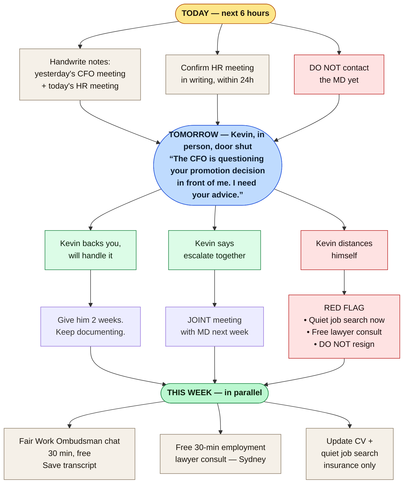

# Decision Map — Strategic Next Move

## My read

The CFO has escalated. His comments yesterday (salary, "prove your value", contract review, no-laptop rule) are textbook **adverse action territory** under Fair Work Act s.340 — he is altering your position to your prejudice *because* you exercised a workplace right. That is a **stronger** legal position for you than the original incident. Don't waste it by escalating emotionally.

## My read on the leverage

> CFO costs the company **~$250k–$600k** to replace. You cost **~$30k–$80k**. Median FWC settlement is **$4k–$6k**. → **Internal leverage > litigation. Always.**

---

## What to do — flowchart

---

## Cost-efficiency ladder — cheapest leverage first

| # | Move | Your cost | Your effort | Leverage gained |
|---|---|---|---|---|
| 1 | Handwritten notes + HR confirmation email | $0 | 1 hour | ⭐⭐⭐⭐⭐ |
| 2 | Get Kevin onside | $0 | 1 meeting | ⭐⭐⭐⭐⭐ |
| 3 | Fair Work Ombudsman chat | $0 | 30 min | ⭐⭐ (info only) |
| 4 | Free employment lawyer consult | $0 | 30 min | ⭐⭐⭐⭐ |
| 5 | Join Finance Sector Union | $20/wk | 10 min | ⭐⭐⭐ |
| 6 | Escalate to MD (with Kevin) | $0 | 1 meeting | ⭐⭐⭐⭐ |
| 7 | Anonymous SafeWork NSW tip | $0 | 15 min | ⭐⭐⭐ (deterrent, not personal win) |
| 8 | File FWC general protections (no dismissal) | $0 file, ~$5k legal | High | ⭐⭐ — tips your hand, median payout $4-6k |
| 9 | Federal Court adverse action case | $30k–$100k | 1–3 years | ⭐ — only worth it if dismissed |

**Stop at the lowest step that resolves the problem.** Each step preserves the next as leverage — don't skip ahead.

---

## Fair Work Ombudsman — what it is, and how to use it

**No commitment, no record on your employment file.** Free advice from a government body — also useful as a paper trail you sought professional guidance.

- **Online chat (fastest):** https://www.fairwork.gov.au/ → "Chat with us" (bottom-right). Saves a written transcript.
- **Phone:** 13 13 94 (Mon–Fri).

**Be clear about what FWO does:** advice only. **It does not enforce** Right to Disconnect, adverse action, or psychosocial hazards. The Fair Work Commission is the tribunal that hears those disputes. SafeWork NSW handles the WHS side.

### 30-minute FWO chat — exact script

1. Open the chat. Use your real name once, then anonymous works.
2. Paste this opener:

   > *"I'd like advice on three things: (1) my employer's obligations under the Right to Disconnect, (2) whether discussing my salary and contract in a meeting after I raised workload concerns constitutes adverse action under s.340, and (3) what 'reasonable additional hours' means under s.62 when my contract says overtime is required."*

3. Then ask explicitly:

   > *"What is the time limit for raising a general protections claim if I am dismissed?"*

   (Answer: **21 days**. Memorise this.)

4. If they say *"we can't enforce that, contact FWC"* — correct answer. Note it, move on.
5. Save the transcript / take screenshots. Done.

**The CFO's "contract says you have to do overtime" line is misleading** — the Fair Work Act caps it at *reasonable* additional hours regardless of what the contract says (s.62). Confirm this with FWO so you have it from the source.

### Where to escalate if you ever need to (don't file yet — just know the doors)

- **Fair Work Commission** — actual disputes: Right to Disconnect, general protections, adverse action.
- **SafeWork NSW** — psychosocial hazards. Anonymous tips: https://www.safework.nsw.gov.au/ → *Report an incident or hazard*. **This is the regulator companies actually fear** — improvement/prohibition notices are public and trigger board attention.

---

## My read on the best path — based on similar cases

> **Documented + Kevin onside + either retained with explicit protection, or quiet exit with severance.**
>
> Court is not the path. Median FWC payout is $4–6k. Litigation costs you 1–3 years and a "litigious" reputation.
>
> Your strongest move is making yourself **more expensive for the company to remove than the CFO is to keep**. That happens through Kevin and your paper trail — not through filing anything yet.

---

## Decision triggers — what to do if…

| If… | Then… |
|---|---|
| Kevin backs you and resolves it | Stop. Stay. Keep documenting in case it restarts. |
| Kevin can't move the CFO | Escalate to MD jointly. |
| MD doesn't act within 2 weeks | Free lawyer consult → consider quiet severance negotiation. |
| You're sidelined, demoted, or "performance managed" | This is adverse action. Lawyer up. The 21-day clock starts only at dismissal. |
| You're offered a "package" to leave | Don't sign anything for 7 days. Lawyer reviews first. Typical floor: 3–6 months salary. |
| You're dismissed | File FWC general protections within **21 days**. Non-negotiable. |

---

## The one thing I want you to remember

> **Slow is fast. Quiet is loud.** Every email asking for the company's position in writing, every Kevin conversation, every handwritten note — silently builds your file. You don't need to say anything threatening. The paper trail does the talking later, if it ever needs to.
