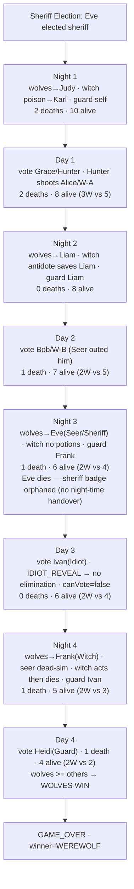

# Plan: Add Scenario 09 — 12-Player Hard Mode (Wolves Win) doc

## Context

`docs/scenarios/` is the single source of truth for backend integration tests
(Spring + STOMP) and frontend Playwright E2E tests. Scenarios 01–08 already
cover 4–7 player CLASSIC games. There is no 12-player HARD_MODE reference
scenario, and no scenario exercises **all** roles together
(Werewolf×4 + Seer + Witch + Hunter + Guard + Idiot + Villager×3 + Sheriff).

This new scenario is the canonical prompt for writing e2e + unit tests
against the current implementation. It also pins down two audio assertions
that should hold every night:

1. `seer_open_eyes.mp3` and `seer_close_eyes.mp3` each play **exactly once
   per night** the seer phase runs — alive or dead-sim. SEER_PICK → SEER_RESULT
   share one open/close because `AudioService.calculateNightSubPhaseTransition`
   suppresses the close when entering SEER_RESULT (`AudioService.kt:101-104`).
2. `witch_open_eyes.mp3` / `witch_close_eyes.mp3` each play exactly once per
   night the witch phase runs.

## Win-Condition Note (intentional vs. current code)

> **Intended HARD_MODE rule (屠城)** — wolves must slaughter everyone on the
> good side. Two triggers:
>
> 1. **Literal win**: `humanCount == 0` ⇒ wolves win.
> 2. **Logical win** (numeric + no counterplay): after any round resolves
     >    (day vote or night kill),
     >    `wolves >= humans  AND  !hasGuard  AND  !hasWitchWithPotions  AND  !hasHunterWithBullet`
     >    ⇒ wolves win.
     >    - `hasGuard`: a living GUARD is on the board.
>    - `hasWitchWithPotions`: a living WITCH still holds antidote or poison.
>    - `hasHunterWithBullet`: a living HUNTER who has not yet been silenced.
>
> The guard/witch/hunter clauses capture the fact that the good side can still
> delay (guard save), reverse (witch antidote) or counter-kill (hunter shot),
> so mere numeric parity does not end the game.
>
> **Easy / Classic rule (屠边)** — for contrast only, out of scope: wolves
> win by wiping out either all villagers OR all gods.
>
> **Current code**: `WinConditionChecker.kt:16` only checks `others == 0` for
> HARD_MODE. It is missing the entire logical-win branch (no guard/witch/hunter
> awareness). The scenario is written to the intended rule and includes an
> explicit "Expected vs Current" callout so test authors can choose to assert
> intended behavior (fails until bug is fixed) or current behavior.

Reference implementation of the intended check (to paste into the scenario
doc so test authors have a concrete target):

```kotlin
fun isWolfWinHardMode(
    wolfCount: Int,                 // living wolves
    humanCount: Int,                // living non-wolves
    hasGuard: Boolean,              // living GUARD
    hasWitchWithPotions: Boolean,   // living WITCH with ≥1 potion
    hasHunterWithBullet: Boolean,   // living HUNTER who can still shoot
): Boolean {
    if (humanCount == 0) return true
    return wolfCount >= humanCount
        && !hasGuard
        && !hasWitchWithPotions
        && !hasHunterWithBullet
}
```

Concrete consequence for this scenario — game ends at end of **Day 4**:

| Check point | W | H | Guard alive? | Witch w/ potion? | Hunter w/ bullet? | Verdict |
|---|---|---|---|---|---|---|
| End N1 (poison on Karl) | 4 | 6 | Yes (Heidi) | Yes (antidote only) | Yes (Grace) | proceed |
| End D1 (Grace voted → shoots Alice) | 3 | 5 | Yes | Yes (antidote) | **No** | proceed |
| End N2 (antidote saves Liam) | 3 | 5 | Yes | **No** (both spent) | No | proceed (guard alive) |
| End D2 (Bob voted) | 2 | 5 | Yes | No | No | proceed (guard alive) |
| End N3 (Eve killed) | 2 | 4 | Yes | No | No | proceed (guard alive) |
| End D3 (Ivan revealed, no elim) | 2 | 4 | Yes | No | No | proceed (guard alive) |
| End N4 (Frank killed) | 2 | 3 | Yes | No (Frank dead) | No | proceed (guard alive) |
| End D4 (Heidi voted) | 2 | 2 | **No** | No | No | **wolves ≥ humans & no counterplay ⇒ WOLVES WIN** |

The flow is tuned so every counterplay mechanism is pre-exhausted by D4 — the
Hunter's bullet is already spent on D1, both witch potions are spent by N2,
the witch herself dies N4 — so removing the Guard on D4 is the single move
that flips `!hasGuard && !hasWitch && !hasHunter` all true at once. This
exercises the full counterplay-tracking surface of the intended rule.

## Deliverable

A single new scenario file in the same shape as `scenario-07` / `scenario-08`,
plus a one-line index entry. Documentation only — no code changes.

| File | Action |
|------|--------|
| `docs/scenarios/scenario-09-twelve-player-hard-mode.md` | **create** |
| `docs/scenarios/README.md` | **edit**: add row 09 to scenario index table |

## Document Structure

Mirror scenario-07/08 section order so test authors have the same anchors:

```
# Scenario 09 — 12-Player Hard Mode: Wolves Win Day 4
1. Cast (12-row table, seat 1..12)
2. Room Configuration (JSON)
3. Win-Condition Note (intended rule vs current code)
4. Night Subphase Sequence
5. Game Summary table (Round / Event / Alive After)
6. Phase Flow / Game Timeline (Steps 0..N)
7. Per-Step Detail — Sheriff election, N1, D1 (HUNTER_SHOOT), N2, D2,
   N3 (sheriff dies at night), D3 (IDIOT_REVEAL, no badge handover), N4
   (seer dead-sim), D4 (game-over fires after vote)
8. Audio Assertions table (incl. N4 seer dead-sim coverage)
9. Deaths Timeline (Summary)
10. Assertions Summary (Backend Integration + Frontend E2E)
11. Full Role Reveal Table (end state)
```

## Cast & Room Config

Deterministic seat ordering so test fixtures map directly:

| Seat | Nickname | Role     | Fate                                          |
|------|----------|----------|-----------------------------------------------|
| 1    | Alice    | WEREWOLF | Host (= WOLF-A); Hunter-shot Day 1            |
| 2    | Bob      | WEREWOLF | WOLF-B; voted out Day 2                       |
| 3    | Carol    | WEREWOLF | WOLF-C; survives (winner)                     |
| 4    | Dave     | WEREWOLF | WOLF-D; survives (winner)                     |
| 5    | Eve      | SEER     | Elected sheriff; wolf-killed Night 3          |
| 6    | Frank    | WITCH    | Wolf-killed Night 4                           |
| 7    | Grace    | HUNTER   | Voted out Day 1 → shoots Alice                |
| 8    | Heidi    | GUARD    | Voted out Day 4 → triggers wolves >= others   |
| 9    | Ivan     | IDIOT    | Voted Day 3 → reveals → survives, loses vote  |
| 10   | Judy     | VILLAGER | VILLA-1; wolf-killed Night 1                  |
| 11   | Karl     | VILLAGER | VILLA-2; witch-poisoned Night 1               |
| 12   | Liam     | VILLAGER | VILLA-3; survives at game over                |

```json
{
  "hasSeer": true, "hasWitch": true, "hasHunter": true,
  "hasGuard": true, "hasIdiot": true, "hasSheriff": true,
  "playerCount": 12, "winCondition": "HARD_MODE"
}
```

`Room.kt:33-56` already supports every flag above.

## Night Subphase Sequence

```
WEREWOLF_PICK → SEER_PICK → SEER_RESULT → WITCH_ACT → GUARD_PICK → COMPLETE
```

Confirmed against `NightOrchestrator.nightSequence()`
(`NightOrchestrator.kt:62-74`) — order is set by `@Order`-annotated handlers;
GUARD acts after WITCH (matches scenario-07).

## Corrections Folded In From The Original Draft

The user's original draft had three issues; the final doc must use the
corrected values:

1. **Night 2 deaths = 0**, not 1 — witch antidote saves the wolf kill on Liam.
2. **Day-transition audio order**: `rooster_crowing.mp3` **before**
   `day_time.mp3`. Matches `AudioService.kt:53-57`.
3. **Win condition**: rule is `wolves >= others`, not `others == 0`. Game
   ends Day 4 with 2W killed (Alice via Hunter, Bob via vote), not Day 5
   with all-others-dead.

## Game Flow



## Per-Round Specifics

For every Night/Day section, the doc must list (in this column order to match
scenario-08):

- **Actions** — `Actor / Action / Target / Constraint`
- **Events Emitted** — `Channel / Event / Key Fields` including the
  `AudioSequence` accompanying each `NightSubPhaseChanged`
- **Player Screens** — table per role (active / waiting / dead-spectator)

| Round | Wolf target  | Seer check / result   | Witch action          | Guard target | Net deaths |
|-------|--------------|-----------------------|-----------------------|--------------|------------|
| N1    | Judy (V1)    | Alice → WOLF          | poison Karl (V2)      | self (Heidi) | Judy, Karl |
| N2    | Liam (V3)    | Bob → WOLF            | antidote saves Liam   | Liam         | —          |
| N3    | Eve (Seer)   | Carol → WOLF          | no potions, skip      | Frank        | Eve        |
| N4    | Frank (Witch)| **dead-sim** (Eve †)  | skip (no potions; will die end-of-night) | Ivan | Frank |

Guard validity check:
- N1 self → N2 cannot pick Heidi → picks Liam ✓
- N2 Liam → N3 cannot pick Liam → picks Frank ✓
- N3 Frank → N4 cannot pick Frank → picks Ivan ✓

| Day | Vote outcome                                          | Special action / sub-phase            | Deaths       |
|-----|-------------------------------------------------------|---------------------------------------|--------------|
| D1  | Grace (Hunter) majority-eliminated                    | `HUNTER_SHOOT(Alice)` then VOTING_CONTINUE | Grace, Alice |
| D2  | Bob (W-B) eliminated (Seer outed him via discussion + sheriff 1.5× weight tie-break) | — | Bob |
| D3  | Ivan (Idiot) targeted; uses `IDIOT_REVEAL` in VOTE_RESULT sub-phase | `IDIOT_REVEAL` → `canVote=false`, `idiotRevealed=true`, no elimination | — |
| D4  | Heidi (Guard) majority-eliminated; **win check fires** before next subphase | — | Heidi → game over |

Mechanic notes:

- **Idiot** confirmed against `IdiotHandler.kt:22-42`. `IDIOT_REVEAL` only
  accepted in `DAY_VOTING / VOTE_RESULT`, sets `canVote=false` +
  `idiotRevealed=true`, emits `DomainEvent.IdiotRevealed`. After D3, Ivan
  cannot vote on D4.
- **Hunter** confirmed against `VotingPipeline.kt:195-217`. `HUNTER_SHOOT`
  triggers `PlayerEliminated` for shot target; if shot target was sheriff,
  `BADGE_HANDOVER` opens (not the case here — Alice is not sheriff).
- **Sheriff badge** confirmed against `VotingPipeline.kt:238-294`.
  Badge handover sub-phase is **only triggered by elimination during the
  voting/hunter flow** (`VotingPipeline.handleVoteResult` and
  `handleHunterAction` paths). `NightOrchestrator` does **not** touch
  `game.sheriffUserId` when a sheriff dies at night — so when Eve dies N3,
  her badge becomes orphaned (held by a dead player, never reassigned). The
  doc must call this out as observed behavior.

## Audio Assertions Section

Add a dedicated table the test author can iterate over:

| #  | Assertion                                                                                                                        | Source of truth                                                                                                            |
|----|----------------------------------------------------------------------------------------------------------------------------------|----------------------------------------------------------------------------------------------------------------------------|
| A1 | Each NIGHT entry emits `[goes_dark_close_eyes.mp3, wolf_howl.mp3]`; `wolf_open_eyes.mp3` follows from the role-loop              | `AudioService.kt:46-51` + `NightOrchestrator` broadcast                                                                    |
| A2 | Each DAY entry emits `[rooster_crowing.mp3, day_time.mp3]` in that order                                                         | `AudioService.kt:53-57`                                                                                                    |
| A3 | `seer_open_eyes.mp3` plays exactly once per night the seer subphase runs (alive N1–N3; **dead-sim N4**)                          | `AudioService.kt:142-148` (SEER_RESULT returns null open) + `calculateDeadRoleAudioSequence` paired handling at `:236-251` |
| A4 | `seer_close_eyes.mp3` plays exactly once per night seer subphase runs                                                            | Close suppressed when entering SEER_RESULT (`:101-104`)                                                                    |
| A5 | `witch_open_eyes.mp3` and `witch_close_eyes.mp3` each play exactly once per night witch subphase runs (alive N1–N4)              | `WitchAudioConfig.kt` + sub-phase transition (`:90-127`)                                                                   |

Spot-check nights:
- **N1** witch uses poison (full witch flow, alive)
- **N2** witch uses antidote (full witch flow, alive)
- **N3** witch alive but no potion → skips
- **N4** seer **dead-sim** branch exercised via
  `calculateDeadRoleAudioSequence`; witch alive last time (skips)

## Index Entry (README.md)

Append one row to the scenario table in `docs/scenarios/README.md:11-19`:

```
| 09 | scenario-09-twelve-player-hard-mode.md | 12 (W×4, S, Wi, H, G, I, V×3) | Wolves win Day 4 | All roles enabled, HARD_MODE intended rule (wolves≥others), Hunter shot, Idiot reveal, sheriff dies at night (orphaned badge), seer dead-sim audio |
```

Do not touch `ROLE-PHASE-SCREENS.md` — its existing matrix already covers
every role used here.

## Verification

Documentation-only, so verification = review-by-reading:

1. Visual check on `scenario-09-twelve-player-hard-mode.md` — same table
   widths and emoji-free style as scenario-07/08.
2. Open `docs/scenarios/README.md` in a Markdown previewer and confirm the
   new row 09 renders cleanly within the existing table.
3. Cross-check every Night/Day row against the Game Summary table — total
   deaths must equal Σ per-round deaths. Expected:
   `Judy, Karl, Grace, Alice, Bob, Eve, Frank, Heidi` = 8 dead;
   alive at game over = `Carol, Dave, Liam, Ivan` = 4 (2W + 2 others).
4. Confirm intended-rule fires at end of Day 4: `wolves=2, others=2`,
   `wolves >= others` → WEREWOLF wins.
5. The "Expected vs Current" callout must explicitly show that
   `WinConditionChecker.check(alivePlayers={2W, 2 others}, HARD_MODE)`
   currently returns `null` (because `others != 0`) — meaning a test asserting
   the intended post-vote `wolves >= others` rule will fail until the bug is
   fixed. The callout must clarify the trigger is **post-vote only**, not
   post-night.
6. The "sheriff badge orphaned on night-death" observation should also be
   flagged as a separate suspected bug in the assertions section, distinct
   from the win-condition bug.

No backend or frontend code is edited and no tests are added in this PR — the
doc is the input artifact for the next PR that will write tests.